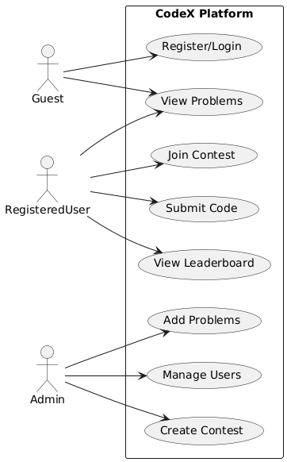
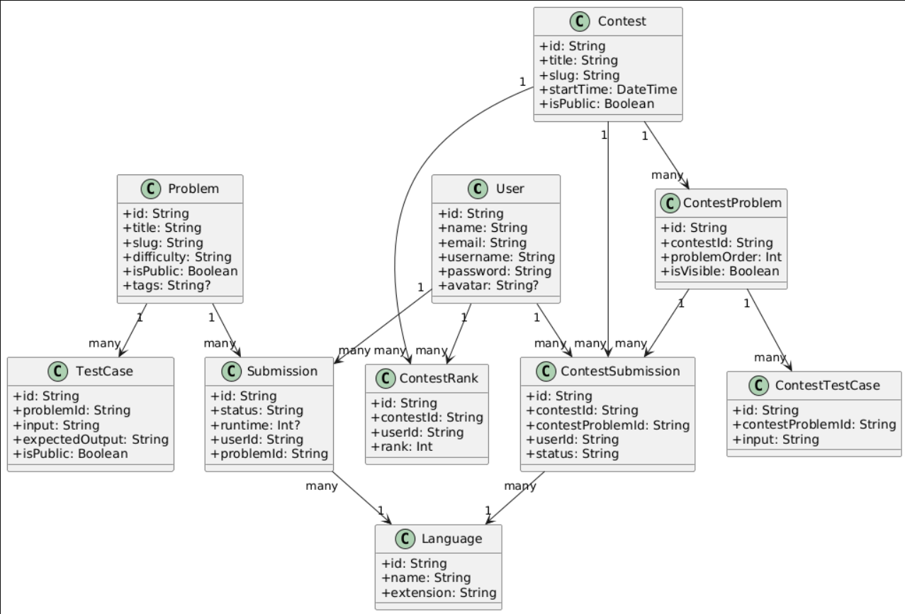

# 🚀 CodeX - Online Coding Platform

CodeX is a full-stack online coding platform that allows users to practice coding problems, participate in timed contests, track their ratings, and view detailed analytics of their performance — all in real-time.


---

## 🧠 Features

- 🧪 **Test Cases & Judging**: Automatic evaluation using hidden and public test cases.
- 💻 **Multi-language Support**: Submit solutions in Python, C++, Java, and more.
- 🧑‍💻 **User Authentication**: Secure signup/login with JWT-based auth.
- 📊 **Submissions & Results**: Real-time feedback with test case breakdown.
- 🏆 **Contests**: Participate in live rated contests with leaderboards.
- 📈 **Rating System**: Elo-based user rating and rating history tracking.
- 🧮 **Leaderboard**: Real-time contest standings with tie-breaking on score and time.
- ✍️ **Admin Tools**: Add/edit problems, manage contests, view submissions.

---

## ⚙️ Tech Stack

### 💻 Frontend
- **React.js** + **TypeScript**
- **TailwindCSS** + **ShadCN** UI
- **Axios** for API handling
- **React Router** for routing

### 🌐 Backend
- **Node.js** + **Express.js**
- **Prisma ORM** + **MySQL**
- **JWT** for authentication
- **Judge0** API for code execution

---

## 📦 Installation

### 🛠️ Prerequisites

- Node.js v18+
- MySQL or Dockerized DB
- Prisma CLI

### ⚙️ Setup

```bash
git clone https://github.com/yourusername/codex.git
cd codex

# Backend setup
cd server
npm install
npx prisma generate
npx prisma migrate dev --name init

# Frontend setup
cd ../client
npm install
npm run dev






